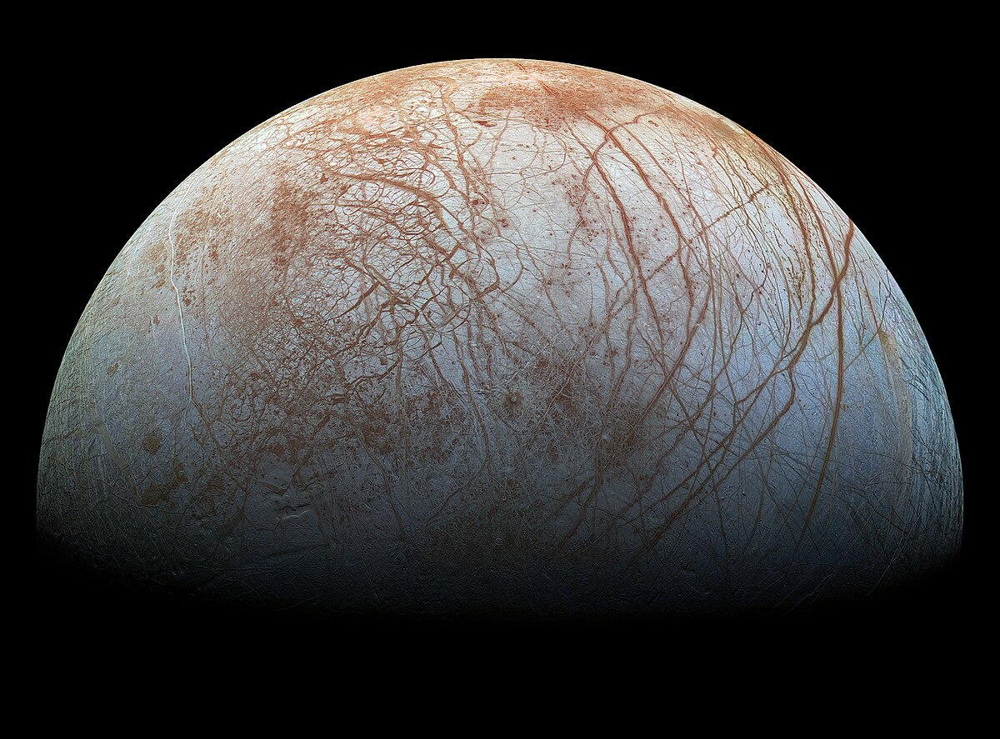

# Workshop 4

By: Hudson MacArthur

## Emphasis

One may *object to the first premise* by denying that 1,000,000 grains of sand make a heap. But 1,000,000 is just an arbitrary large number, and the argument will apply with any such number. So the response must *deny outright that there are such things as heaps*. Peter Unger defends this solution. However, A. J. Ayer repudiated it when presented with it by Unger: "If we regard everything as being composed of atoms, and think of Unger as consisting not of cells but of the atoms which compose the cells, then, as David Wiggins has pointed out to me, a similar argument could be used to prove that *Unger, so far from being non-existent, is identical with everything that there is*. We have only to substitute for the premise that the subtraction of one atom from Unger's body never makes any difference to his existence the premise that the addition of one atom to it never makes any difference either."

## Strong

The **goliath frog** (Conraua goliath), otherwise known commonly as the **giant slippery frog** and the **goliath bullfrog**, is a species of frog in the family **Conrauidae**. The **Goliath frog** is the largest living frog. Specimens can reach up to about 35 centimetres (14 in) in snout–vent length and 3.3 kilograms (7.3 lb) in weight.This species has a relatively small habitat range in Cameroon and Equatorial Guinea.Its numbers are dwindling due to habitat destruction, collection for food, and the pet trade.

## Lists

### Unordered Lists

- List item 1
- List item 2
  - Sub item 1
  - Sub item 2
- List item 3

### Ordered Lists

1. First item
2. Second item
    1. Sub item one
    2. Sub item two
3. Third item

## Images



['Propreantepenultimate' on Wiktionary](https://en.wiktionary.org/wiki/propreantepenultimate)

## Including Code

### Inline

In HTML the `` tag is used to display pictures.

### Code Fences

```html
<nav>
    <ul>
        <li><a href="index.html">Home</a></li>
        <li><a href="grid.html">Grid</a></li>
        <li><a href="https://trentu.ca">Trent</a></li>
        <li><a href="https://loki.trentu.ca">Loki</a></li>
    </ul>
</nav>
```

```css
body {
  font-family: system-ui, -apple-system, BlinkMacSystemFont, "Segoe UI", Roboto,
    Oxygen, Ubuntu, Cantarell, "Open Sans", "Helvetica Neue", sans-serif;
  height: 100vh;
  display: flex;
  flex-direction: column;
}
```
